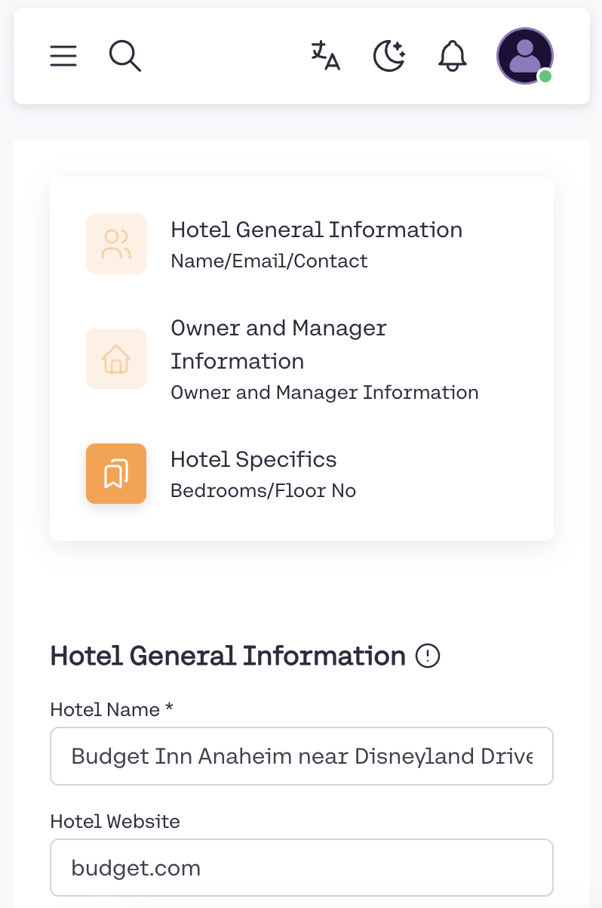
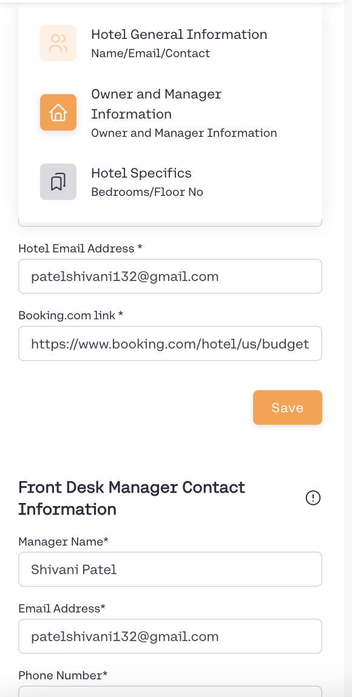
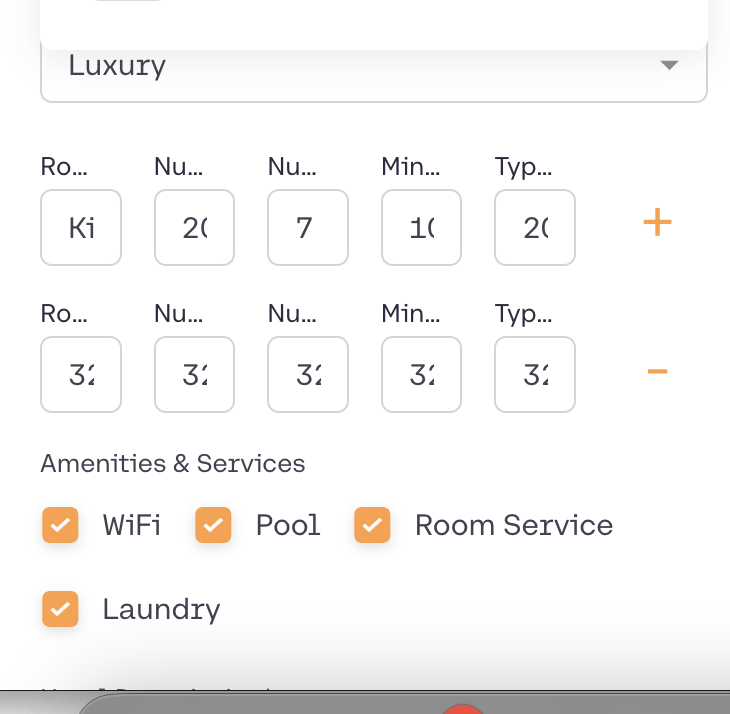

# VINAY'S ANSWER

## GOAL 1: Data Scraping and Structuring

Your original code is in index_old.js
My improved code is in index_vinay.js
run the script by using this command in the terminal "node index_vinay.js"

Output will be the scraped hotel data in structured json format, along with informative logs of the data scraping and structuring process.

example json object from the output you will see in the console logs:

---

{
title: 'Sandpiper Motel',
address: 'Costa Mesa',
location_url: 'https://www.booking.com/hotel/us/sandpiper-motel.en-gb.html?aid=304142&label=gen173nr-1FCAQoggJCKXNlYXJjaF9idWRnZXQgaW5uIGFuYWhlaW0gbmVhciBkaXNuZXlsYW5kSAlYBGi0AogBAZgBCbgBB8gBDNgBAegBAfgBA4gCAagCA7gCrenotAbAAgHSAiQ5ODJlMWRhZS01Y2FhLTQ5ZjQtOGRhMi02ODM4NGIzMmVlYTXYAgXgAgE&ucfs=1&arphpl=1&checkin=2024-07-19&checkout=2024-07-20&group_adults=2&req_adults=2&no_rooms=1&group_children=0&req_children=0&hpos=9&hapos=9&sr_order=popularity&srpvid=0ef9441615e50323&srepoch=1721382070&all_sr_blocks=52511201_127045029_2_0_0&highlighted_blocks=52511201_127045029_2_0_0&matching_block_id=52511201_127045029_2_0_0&sr_pri_blocks=52511201_127045029_2_0_0__11900&from=searchresults&map=1',
review_count: '211',
score: '6.0',
price: 'US$119',
roomtype: 'Standard King Room1 double bed',
urgency_roomcount: '6',
searchTerm: 'Budget Inn Anaheim near Disneyland',
countryCode: 'us',
userCurrency: 'USD'
},

---

I CHANGED THE SCRAPING METHOD

-- Old Version: Uses axios to fetch the HTML content, then processes it using JSDOM. This method is effective for simpler server-side rendered pages but might not work well with JavaScript-heavy sites where content is dynamically loaded.

---New Version: Utilizes puppeteer, a headless browser, which allows for interaction with web pages as if a real user were browsing. This is particularly useful for scraping modern web applications that rely heavily on JavaScript.

I ADDED/FIXED FEW DATA FIELDS THAT ARE USEFUL TO SCRAPE FOR INNKEEPER

ADDED review_count, roomtype, urgency_roomcount, and location_url fields.

review_count : added this for better context on the credibility of the review score value (out of 10) that we also have in score field.

urgency_roomcount is the number of rooms left to book in that property. this is relevant for dynamic pricing based on availability

roomtype gives more context to the the type of room and bed recommended for the shown price of the booking. that allows for contextual comparison for dynamic pricing

location_url is a unique url on booking.com that displays a pin for that property on a proprietary map of booking.com -- this has limited relevance for innkeeper but included this as there was no other way available to find direct location of the property as booking.com doesnot reveal direct location coordinates anywhere, they use a encoded "label" attribute and other identifier attributes from this location_url to uniquely identify the property on their backenf and render a location pin on their map.

FIXED countryCode, userCurrency, score

countryCode & userCurrency was not being fetched correctly in the original version of the code. fixed that using a headless browser with Puppeteer

score : minor fix as it was grabbing the first word in the text string not second as it should.

--Dynamic Content Handling: Puppeteer operates a headless browser that fully renders the page, including executing JavaScript just like a standard browser would. This ensures that all dynamic content, which includes JavaScript modifications after page load, is processed and available.

-- True Browser Environment: By leveraging a headless browser, all scripts on the page are executed, and all dynamically loaded content (like currency settings which might depend on scripts to detect the user’s location or settings) are properly fetched and rendered.

ADDED BETTER ERROR HANDLING AND LOGGING FOR DEBUGGING

Added extensive logging throughout the script, especially in the puppeteer's page evaluation where each step of data extraction is logged. This would be particularly helpful for understanding the flow of data and identifying where things might go wrong in a complex scraping operation.

## GOAL 2: UI Review and Enhancement Suggestions

- LOGIN PAGE LOOKS AND WORKS FINE FOR YOUR PRODUCT LAUNCH

- Reviewing "NEW USER SETUP" PAGE:

UX/FRONTEND ISSUES FOUND ---

OVERALL, IT DOES NOT LOOK MOBILE OPTIMIZED. MOST USERS IN YOUR TARGET SEGMENT WILL BE USING IT ON MOBILE.

### 1. In Mobile View, the Sticky Header is Clunky and Obstructing (not scrollable!!)

Header in Mobile View on the top takes up a very big chunk of screen space and hinders the experience of data input by new user.

    Suggestion: make the header also scrollable with the whole component in a container that contains this header as well as input form below.

### 2. Too Much cognitive load for a new user to fill up all the input fields.

Good that you have made three sections for categorising inputs into: Hotel General Information, Owner and Manager Information, and Hotel Specifics. But it would be cognitively a more pleasant and easier UX for a new user if there was three steps to fill inputs, one for each section and you could do progressive onboarding of the new user. Break the form into smaller, more digestible steps using a multi-step wizard format. Use JavaScript to create a step-by-step interaction model, showing one section of the form at a time. Improves user engagement by reducing cognitive load and making the data entry process seem less daunting.

    example code snippet for this:
    const steps = ['General Information', 'Manager Information', 'Hotel Specifics'];
        let currentStep = 0;

        function showStep(step) {
        document.getElementById('currentStep').style.display = 'none';
        document.getElementById(step).style.display = 'block';
        }

        function nextStep() {
        if (currentStep < steps.length - 1) {
            showStep(steps[++currentStep]);
        }
        }

### 3. Room details part of Hotel Specifics Section (Mobile View)

        Cluttered Interface: The fields appear tightly packed together, which can overwhelm users and make it difficult to focus on specific input areas.
        Inconsistent Field Sizes: The size variation in input fields and buttons can confuse users, especially when trying to input or edit data.
        Limited Visual Hierarchy: There is little distinction between different sections and elements, making it hard to navigate the form efficiently.
        Confusing Buttons: The '+' and '-' buttons used for adding and removing room types are not immediately obvious as interactive elements.

        Suggestion:  Increase padding and margin around input fields and section dividers to create a more breathable layout. Improved visual clarity will enhance the user's ability to interact with the interface more comfortably and reduce errors during data entry. Standardize the sizes of input fields to maintain consistency throughout the form. A consistent interface promotes a better user experience by making the form appear more organized and easier to navigate.
        Use subtle shading or color differences to distinguish sections, and consider font size variations or bold headings to denote different parts of the form. Enhancing the visual hierarchy will guide the user through the form filling process more intuitively, improving usability and satisfaction. Redesign the buttons to be more intuitive (e.g., larger, labeled buttons with clear actions) and place them near the fields they impact.

        Example Code Snippet in React for improved RoomDetails component usinf styled-components:

            import React, { useState } from 'react';
            import styled from 'styled-components';

            const Container = styled.div`
            background-color: #f8f9fa;
            padding: 20px;
            margin-bottom: 20px;
            border-radius: 8px;
            `;

            const Input = styled.input`
            width: 100%;
            padding: 8px;
            margin: 10px 0;
            box-sizing: border-box;
            border: 1px solid #ccc;
            border-radius: 4px;
            `;

            const Button = styled.button`
            padding: 10px 20px;
            background-color: #0056b3;
            color: white;
            border: none;
            border-radius: 5px;
            cursor: pointer;
            margin-top: 10px;
            `;

            const Label = styled.label`
            font-weight: bold;
            display: block;
            margin-top: 20px;
            `;

            const RoomDetails = () => {
            const [rooms, setRooms] = useState([{ type: '', number: '', minRate: '', typRate: '' }]);

            const handleInputChange = (index, event) => {
                const values = [...rooms];
                values[index][event.target.name] = event.target.value;
                setRooms(values);
            };

            const handleAddRoom = () => {
                setRooms([...rooms, { type: '', number: '', minRate: '', typRate: '' }]);
            };

            const handleRemoveRoom = (index) => {
                const values = [...rooms];
                values.splice(index, 1);
                setRooms(values);
            };

            return (
                <Container>
                {rooms.map((room, index) => (
                    

                    <Label>Room {index + 1}</Label>
                    <Input
                        type="text"
                        name="type"
                        value={room.type}
                        onChange={(e) => handleInputChange(index, e)}
                        placeholder="Room Type"
                    />
                    <Input
                        type="number"
                        name="number"
                        value={room.number}
                        onChange={(e) => handleInputChange(index, e)}
                        placeholder="Number of Rooms"
                    />
                    <Input
                        type="number"
                        name="minRate"
                        value={room.minRate}
                        onChange={(e) => handleInputChange(index, e)}
                        placeholder="Minimum Rate"
                    />
                    <Input
                        type="number"
                        name="typRate"
                        value={room.typRate}
                        onChange={(e) => handleInputChange(index, e)}
                        placeholder="Typical Rate"
                    />
                    {index > 0 && (
                        <Button onClick={() => handleRemoveRoom(index)}>Remove</Button>
                    )}
                    

                ))}
                <Button onClick={handleAddRoom}>Add Another Room Type</Button>
                </Container>
            );
            };

            export default RoomDetails;

---

# USING CHROME DEV TOOLS FOR ANALYSIS -- SEE COMMENTARY BELOW:

## Console TAB (few issues to fix)

Form Accessibility and Functionality Issues

Detected Issues\*\*:

- Several form elements are missing necessary `id` or `name` attributes, preventing proper identification and interaction.
- Incorrect or missing labels for form elements which affects accessibility and form usability.

Specific Errors

1. Missing ID and Name Attributes

   - **Error Message**: "A form field element should have an id or name attribute."
   - **Details**: Six form elements lack these attributes, impacting the form's functionality and accessibility.
   - **Recommendation**: Ensure every input element in the form is provided with unique `id` and `name` attributes for better HTML document structure and functionality.

2. Incorrect Use of Label Tags

   - **Error Message**: "Incorrect use of label for FORM_ELEMENT."
   - **Details**: Labels are improperly associated with form elements, potentially causing issues with form accessibility.
   - **Recommendation**: Verify that all `label` elements correctly reference the `id` of the corresponding input fields to ensure proper form labeling and accessibility.

3. No Label Associated with a Form Field
   - **Error Message**: "No label associated with a form field."
   - **Details**: A form field is missing a label, which is crucial for accessibility and user understanding.
   - **Recommendation**: Add `label` elements for each form field, and ensure they are correctly associated either by wrapping the `input` element within the `label` or using the `for` attribute correctly.

Code Snippets for Implementation

<!-- Example of correct label and input association -->

<label for="username">Username:</label>
<input type="text" id="username" name="username">

<!-- Example of using label correctly by nesting input within it -->

<label>Username:
<input type="text" name="username">
</label>

## Sources TAB (No big issues)

Good Code Structure - The resources are well-organized into directories such as dashboards, fonts, images, and several script resources. There are numerous JavaScript chunks indicating the use of code splitting, which helps in loading pages faster and only when needed. The presence of scripts from googleapis.com and stripe.com indicates the use of external services like Google Fonts and Stripe for payments. Using Google API for Analytics probably and Stripe for payments.

Suggestion: Ensure that external scripts are loaded asynchronously to minimize impact on initial load times.

## Network TAB (no big issues )

Resource Loading and Performance:

Total Requests: 149 requests.
Data Transferred: 84.5 KB.
Load Time: 6.17 seconds.
DOM Content Loaded: 758 milliseconds.

Reservation.json took 3.90 seconds to load. This is notably high and may need optimization.
In general, the sizes of individual JSON responses and other assets are generally small, indicating efficient data transfer for each request.

high number of 304 responses suggests inefficiencies in Cache Management. While not problematic, making frequent conditional requests to check if the resources have been modified can still add overhead.

HTTP 500 Error --
Endpoint: `subscription`. The server returned an internal server error for the subscription endpoint. This issue could disrupt the user experience by preventing access to subscription-related features.
Suggestion: Investigate the server-side logic handling the subscription endpoint. Check server logs for error details and ensure that the endpoint is robustly handling all possible input cases. Resolving this error will ensure users can access subscription features without interruption, improving overall user satisfaction.

## PERFORMANCE TAB (no big issues)

Summary of Findings:

Total Time: 6.34 seconds
Loading: 19 ms
Scripting: 803 ms
Rendering: 75 ms
Painting: 14 ms
System: 126 ms
Idle: 5303 ms
Observations:

Scripting Time: The time spent on scripting (803 ms) is significant and suggests that JavaScript execution is a considerable part of the total load time.
Idle Time: The high idle time (5303 ms) indicates potential inefficiencies where the browser is waiting for tasks or resources to complete.
Rendering and Painting: Both rendering (75 ms) and painting (14 ms) times are relatively low, indicating that the visual rendering is efficient.
Heap Usage: The JS Heap size is 1.1 MB, with active usage around 56.3 MB, which seems reasonable for typical applications.

---

P.S. Used AI tools for

1. debugging the script -- to correct my selector syntax and adding logging quickly
2. documentation -- to organize my thoughts neatly for UI/Frontend review for some parts

---
